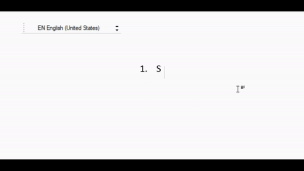

# live-translit
A script that transliterates as you type. On character-by-character basis
## Demo
### 
## Description
<p>Have no desire to learn several keyboard layouts? Your QWERTY WPM is quite good and you want to leverage it to the max?</p>
Then this script will be of help to you.</p>
<p>The easiest way to start is to download the <code>live_translit</code> folder in <code>live-translit/dist/</code> and run the <code>live_translit.exe</code>.<br/>
  Once booted up, the transliterator can be turned on or off by pressing <code>Alt + T</code> (it will be turned on by default).</p>
<p>
The transliterator replaces your input with Ukrainian letters. <br/>
  You can provide your own replacement table by editing <code>tables.py</code> in <code>live-translit/translit_func/translit_tables</code>.</p>
## Replacement Table
<p>Here's the replacement table:</p>

```
  ua = {
        "sch": "щ",
        "sh":"ш",
        "ch":"ч",
        "zh":"ж"
        "ju":"ю",
        "ja":"я",
        "je":"є", 
        "ji":"ї",        
        "w": "в",
        "e": "е",
        "r": "р",
        "t": "т",
        "y": "и",
        "u": "у",
        "i": "і",
        "o": "о",
        "p": "п",
        "a": "а",
        "s": "с",
        "d": "д",
        "f": "ф",
        "g": "г",
        "h": "г",
        "j": "й",
        "k": "к",
        "l": "л",
        "z": "з",
        "x": "х",
        "c": "ц",
        "v": "в",
        "b": "б",
        "n": "н",
        "m": "м",
        "'": "ь",
        "''": "'"
    }
    
```
  
---

_TODO:_
* Add support for multiple languages
* Make a simple GUI for the script

#### Inspired by _Google Input Tools_ and _Google Input Tools Chrome extension_ ❤


